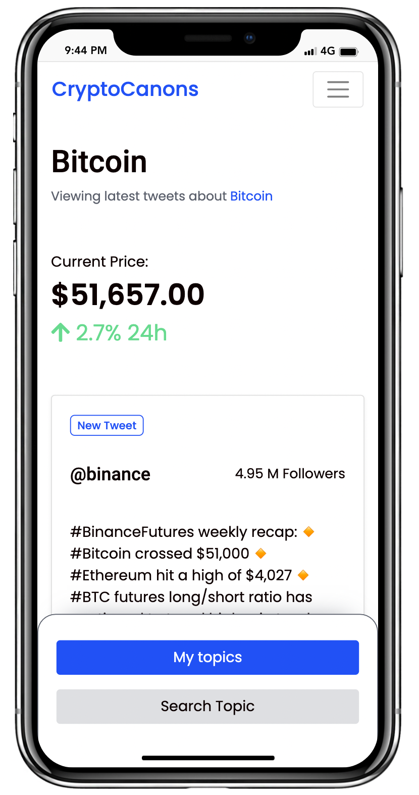
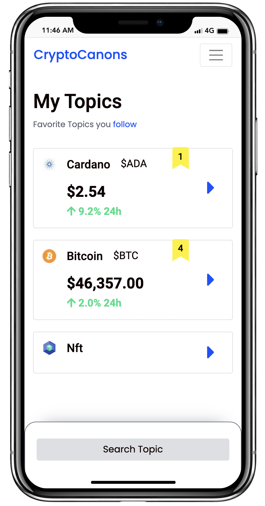
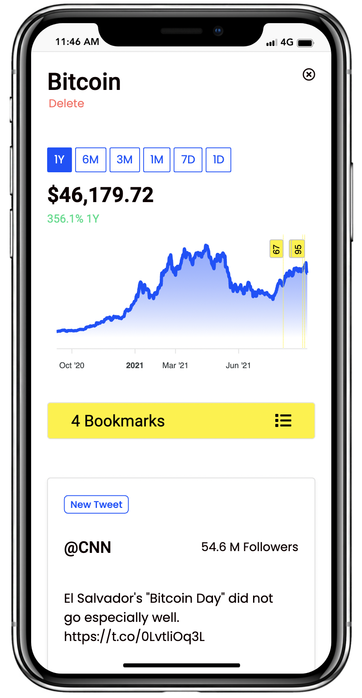
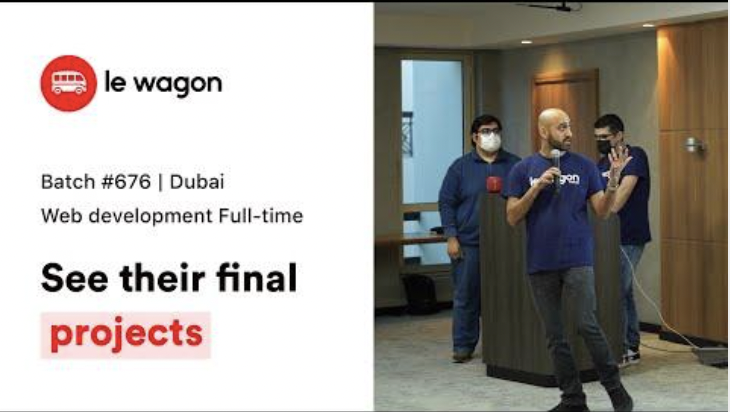
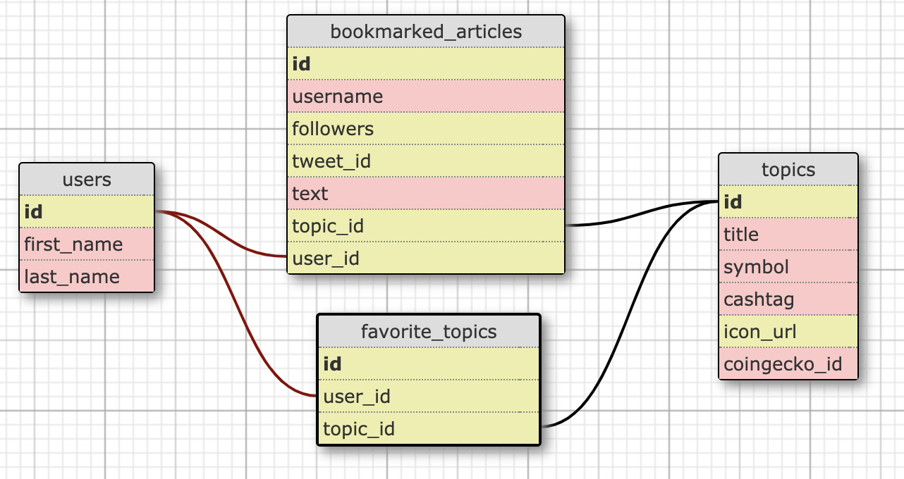

# Welcome 👋 to CryptoCanons

1. [About](#about)
1. [Features](#features)
1. [Screenshots](#screenshots)
1. [Demo and Pitch](#demo-and-pitch)
1. [Roadmap](#roadmap)
1. [Installation](#installation)
1. [Usage](#usage)
1. [Authors and Contributors](#authors-and-contributors)
1. [License](#license)
___
## About

[CryotoCanons](https://www.cryptocanons.com/) is a Cryoto news and price curator web app.

It was developed in 2 weeks as the final project for batch #676 of the [Le Wagon](https://www.lewagon.com/) Web Development Bootcamp in Dubai.

CryotoCanons is a Ruby on Rails web app that uses a base template from [lewagon/rails-templates](https://github.com/lewagon/rails-templates), created by the [Le Wagon](https://www.lewagon.com) team.

Currently it was designed to be __mobile only__, but will be updated to be fully responsive.

___
## Features

[CryotoCanons](https://www.cryptocanons.com/) feature set currently consists of
- User authentication and accounts
- Search for cryptocurrencies or crypto topics e.g. DeFi, NFT to view curated tweets and price for that currency/ topic
- Add the currency/ topic to your favorites
- A dashboard to view your favorite topics
- View the tweets, price and price chart for a saved topic/currency
- Bookmark tweets - this will annotate the chart
- Delete a favorite topic

___
## Screenshots

<div align="center">
  
  
  
  
</div>

___
## Demo and Pitch

[](https://www.youtube.com/watch?v=n8mF1_714zI&t=403s)

___
## Roadmap
- Desktop friendly design
- Convert to PWA
- Add Market cap charts
- Add the ability to place trades/ invest directly from the platform

___
## Tools

<h3 align="left">Languages and Tools utilized in this project</h3>

<br>

<p align="left">

  <a href="https://www.ruby-lang.org/en/" target="_blank">
   </a>

  <a href="https://rubyonrails.org" target="_blank">
   </a>

  <a href="https://developer.mozilla.org/en-US/docs/Web/JavaScript" target="_blank">
   </a>

  <a href="https://www.w3schools.com/css/" target="_blank">
   </a>

  <a href="https://getbootstrap.com" target="_blank">
   </a>

  <a href="https://git-scm.com/" target="_blank">
   </a>

  <a href="https://www.postgresql.org" target="_blank">
   </a>

  <a href="https://heroku.com" target="_blank">
   </a>

JavaScript Plugins
- [Select2](https://select2.org/)
- [Apexchart](https://apexcharts.com/)
- [Chartkick](https://github.com/ankane/chartkick.js?files=1)
- [AOS](https://michalsnik.github.io/aos/)


APIs
- [Twitter v2 Recent Search](https://developer.twitter.com/en/docs/twitter-api/tweets/search/api-reference/get-tweets-search-recent)
- [Coingecko](https://www.coingecko.com/en/api)
- [CoinmarketCap](https://coinmarketcap.com/api/)

___
## Schema

<div align="center">

</div>
___
## Installation

Setup data schema and database locally with seed data

```bash
rails db:migrate

rails db: seed
```


To install Ruby Gems and JavaScript plugins:

```bash
bundle install

yarn install
```

Environment variables:
- Twitter API v2 bearer token
- CoinmarketCap API key

___
## Usage

To run in localhost:3000

```bash
rails s
```
___
## Authors and Contributors

Sajid Akhtar
- Github: [@Sajakhtar](https://github.com/Sajakhtar)
- LinkedIn: [@sajakhtar](https://www.linkedin.com/in/sajakhtar/)
- Twitter: [@sajakhta](https://twitter.com/Sajakhta)


Khamza Habibullah
- Github: [@khamzahabibullah](https://github.com/khamzahabibullah)
- LinkedIn: [@khamzahabibullah](https://www.linkedin.com/in/khamzahabibullah/)

Octavian Serban
- Github: [@octaserban](https://github.com/octaserban)
- LinkedIn: [@octavianserban](https://www.linkedin.com/in/octavianserban/)

Lanre Fabunmi
- Github: [@Leprof20](https://github.com/Leprof20)

With special thanks to [Tarig Bouazzati](https://github.com/tbouzza) and [Andre R Ferrer](https://github.com/andrerferrer) for the teaching, mentoring and general support during the project.

Pull requests are welcome. For major changes, please open an issue first to discuss what you would like to change.
___
## License
[MIT](https://choosealicense.com/licenses/mit/)

___
